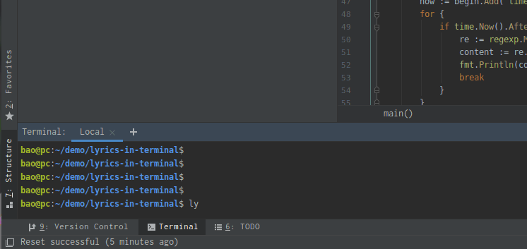

# 命令行终端显示播放歌词

## 功能
可以在编辑器的命令行播放歌词

- 支持单曲循环
## 用法
[下载地址](https://github.com/kyronbao/lyrics-in-terminal/releases/download/v1.0.0/lyric)  

把可执行程序移到环境变量所在目录  
例如linux环境
```
mv lyric /usr/bin/
```
播放显示示例歌词
```
lyric demo\(secret_base\).lrc
```


ps.  
单曲循环需要保证歌词lrc文件的最后一行的时间和歌曲时长一致  

## 歌词下载地址推荐
 https://www.22lrc.com/